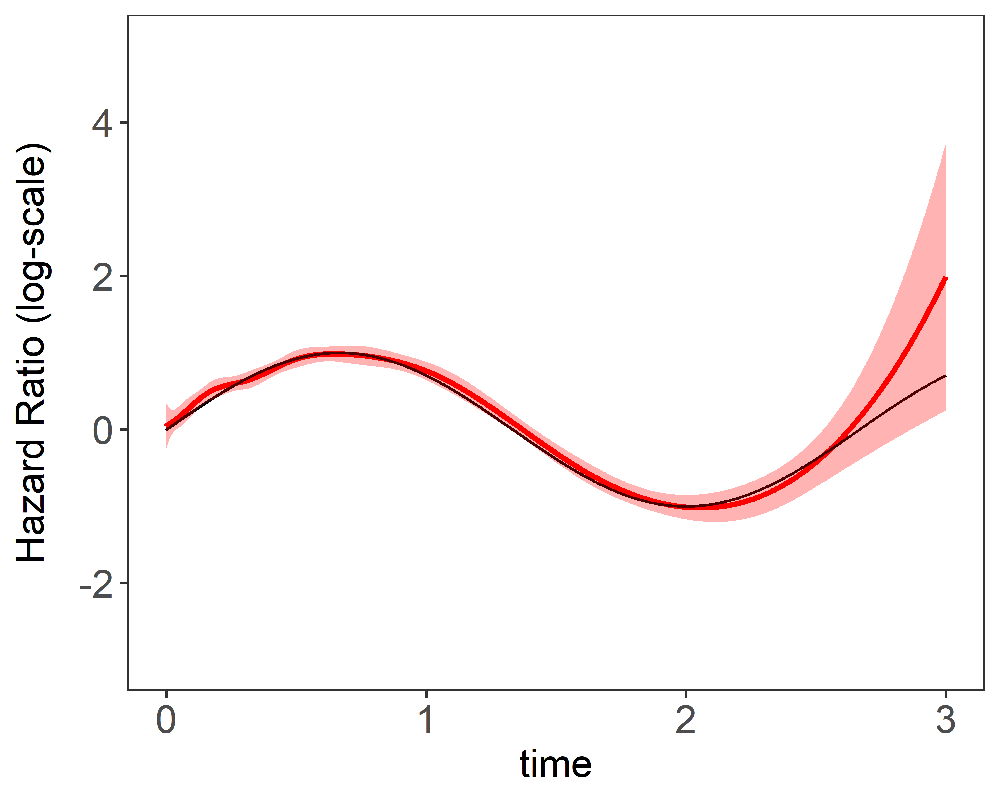
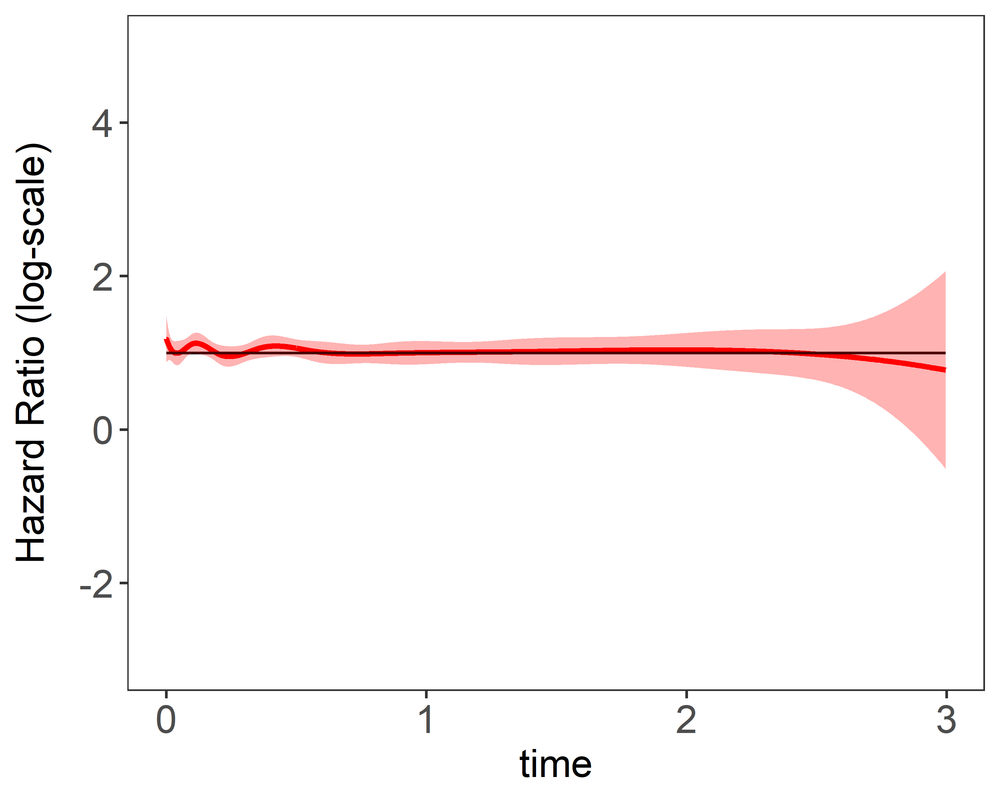
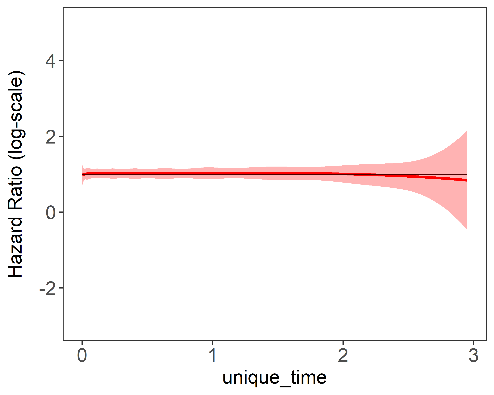
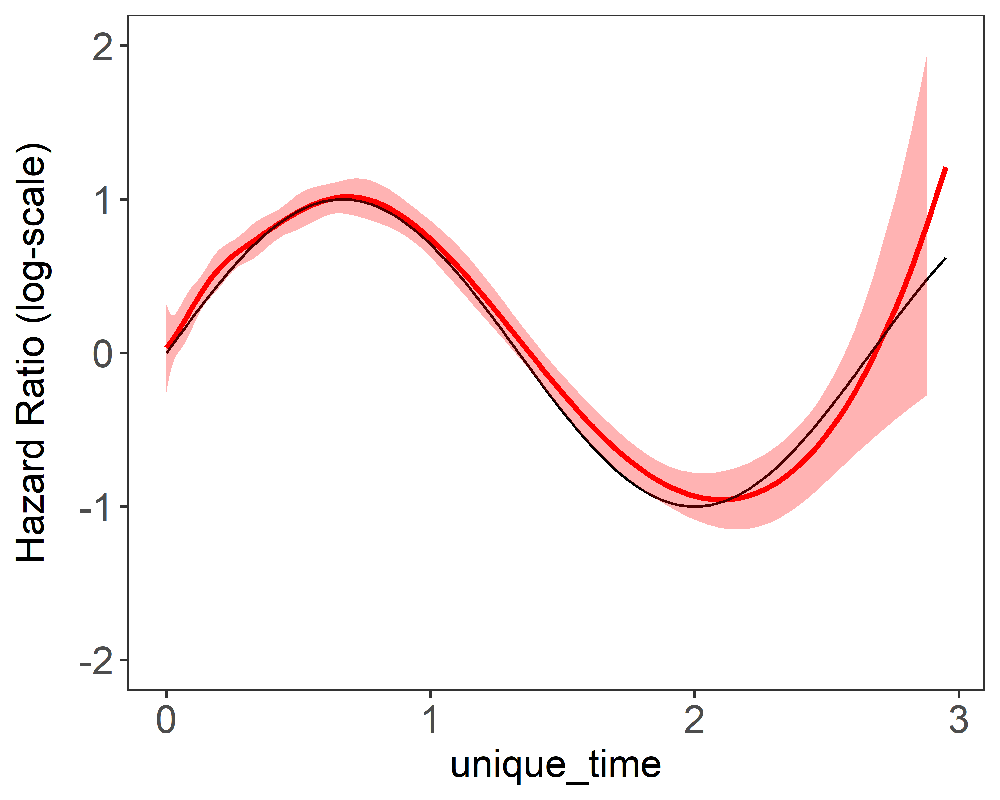

# surtve

## Cox Non-proportional Hazards model with penalization
<!-- badges: start -->
<!-- badges: end -->

PenalizedNR is an R package for fitting penalized Newton's method for the time-varying effects model using mAIC, TIC, GIC and HTIC as information criteria, in particular we span the parameter using basis functions. Utilities for carrying out post-fitting visualization, summarization, and inference are also provided.

## Installation

You can install the released version of PenalizedNR from [Github](https://github.com/umich-biostatistics/surtve) with:

``` r
install.packages("devtools") # you need devtools to install packages from Github
devtools::install_github("umich-biostatistics/surtve")
```

You can import the R package by:

``` r
library (surtv)
```
  

 
## Newton's Method

The data set in section 3.3.1 is included in the \textit{surtvp} as a built-in data set. The data set was named \textit{simulData} and its information can be viewed by

```{r example.simuate.data, eval=FALSE}
load("simulData.RData")
str(simulData)
```

The `surtve()` function requires similar inputs to the familiar `coxph()` from the package survival.

```{r example.fit, eval=FALSE}
surtvep(formula, data = matrix(), ...)
```

"nsplines" specifies the number of basis functions used and the default value is 10. 

"ties": when tied data appear, we support "Breslow" which utilizes Breslow approximation to speed up the algorithm.

"tol": the convergence threshold, smaller value requires more iterations to converge. The default value is 1e-6.

"iter.max": maximum number of iterations allowed. The default value is 20.

"method": "Newton" is the default newton's approach. "ProxN" gives the proximal newton algorithm. Refer to Wu et.al (2021)

"btr": backtracking linesearch stratgy. The default is "dynamic". "static" is also supported. Refer to 

"stop": stoppping criteria.

"parallel": When parallel is "TRUE", shared memory parallel computation is used.

"threads": integers indicating the number of threads used for parallel compuatation.

This is a simple example estimating the simulation data set.
```{r example.fit, eval=FALSE}
fit1 <- surtvep(Surv(time, event)~., data = simulData)
```

The estimation results can be viewed by the `plot()` function.
```
plot(fit1)
```
 


## Penalized Newton's method
In order to add penalty to the penalized Newton's method, three additional parameters can be added.

Now, set a sequence of smoothing paramemter to choose from. The default range is set as
```{r example.fit, eval=FALSE}
#specify smoothing parameter lambda:
lambda_spline = c(1:10)

#if not specified, the default range is set as follows, where n is the sample size
lambda_spline = seq(0, n^(1/3), length.out = 10)
```

Then set the relevant parameters and fit a model to the prepared data:
```{r example.fit, eval=FALSE}
fit.spline <- surtvep(Surv(time, event)~., data = simulData, 
               lambda = c(0:100),
               spline = "Smooth-spline",
               IC = "all")
}
```

The resulting estimation plot with smoothing parameter chosen by TIC can be viewed by 
```{r example.fit, eval=FALSE}
plot(fit.spline, IC = "TIC")
```

 


## Reference

